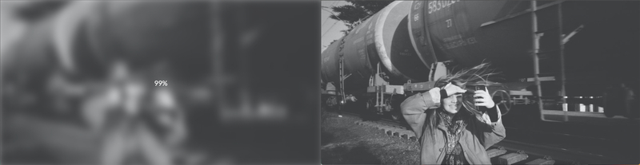

# Blurry Loading

<p>
    <a href="https://mia-blurry-loading.netlify.app">Live Demo</a>
</p>

---
[50days50projects]第5天的练习：Blurry Loading。随着页面的加载，图片慢慢从模糊变清晰。

## What I Learned
1. CSS: 要先定义高和宽，背景图片才会显示
2. CSS: `filter: blur(5px)`将高斯模糊应用于输入图像。`5px`屏幕上有5个像素相互融合，较大的值将产生更多的模糊。`blur()`不接受百分比作为值
3. JavaScript: 一个重要的[工具函数](https://stackoverflow.com/questions/10756313/javascript-jquery-map-a-range-of-numbers-to-another-range-of-numbers)：将一个范围数字映射到另一个数字范围，比如将1 ~ 100的数字范围映射到0 ~ 1之间。

    它接收5个参数：待映射的数值`num`，输入函数范围的最小值`in_min`和最大值`in_max`，以及输出函数范围的最小值`out_min`和最大值`out_max`。函数返回将输入数值映射到输出函数范围后的值。

    ```JavaScript
    const scale = (num, in_min, in_max, out_min, out_max) => {
        return ((num - in_min) * (out_max - out_min)) / (in_max - in_min) + out_min
    }
    /*
    如果想把1 ~ 100的数字范围映射到0 ~ 1之间
    num: 100(原数字范围的最大数)
    in_min: 0
    in_max: 100
    out_min: 1 (目标映射范围的最大数)
    out_max: 0
    */
    ```
    `(num - in_min)`表示将待映射的数值从输入范围的最小值`in_min`偏移，从而得到在输入范围内的偏移量。

    `(out_max - out_min)`表示输出范围的值域大小，用于将偏移量映射到输出范围内。

    `(in_max - in_min)`用于将输入范围映射到0到1的范围内。

    在使用这个函数时需要确保输入的参数值是合法的。

## Reference
1. [MDN - filter](https://developer.mozilla.org/zh-CN/docs/Web/CSS/filter)
